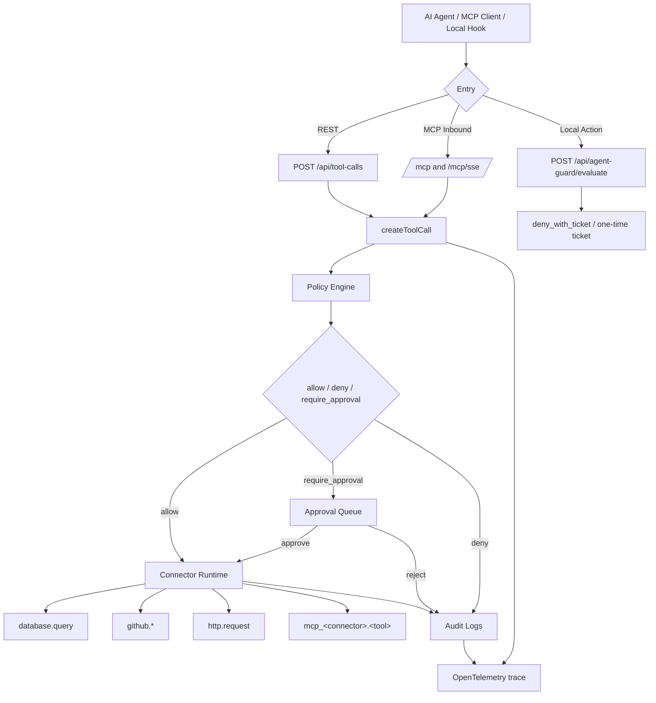

# AgentToolGate

[](https://github.com/aki0225/AgentToolGate/actions/workflows/ci.yml)

AgentToolGate 是一个本地 AI Agent 工具治理网关。它不试图阻止提示词注入发生，而是在 Agent 准备调用真实工具时，把数据库、GitHub、HTTP、MCP 和本地高危动作先收进 policy、approval、secret injection、audit 与 telemetry 链路。

一句话：**不防提示词注入发生，防注入得逞后的高危工具调用后果。**

ATG 是 guardrail，不是 OS sandbox、EDR、企业 DLP 或完整 enforcement boundary。真实高风险使用仍需要最小权限账户、系统 sandbox、网络策略和上游服务自己的权限边界。

## 架构总览



关键事实：

- REST 主链路是 `POST /api/tool-calls -> createToolCall -> Policy / Approval / Audit / Connector Runtime / OTel`。
- MCP Inbound 同时提供 Streamable HTTP `/mcp` 和 SSE fallback `/mcp/sse`；`tools/call` 复用 `createToolCall`，不是旁路。
- MCP Outbound 会把外部 MCP Server 的工具同步成 `mcp_<connector>.<tool>`，再进入同一治理链路。
- Local Action Firewall 通过 `/api/agent-guard/evaluate` 对 Claude / Codex 的本地动作做风险分类、审计和 `deny_with_ticket` 闭环。

## 快速开始

从 [GitHub Release](https://github.com/aki0225/AgentToolGate/releases) 下载 Windows amd64 或 Linux amd64 包，解压后在要保护的项目根目录运行：

```powershell
# Windows
.\agenttoolgate.exe doctor
.\agenttoolgate.exe --open

# Codex 用户
.\agenttoolgate.exe init codex
.\agenttoolgate.exe up --open

# Claude Code 用户
.\agenttoolgate.exe init claude
.\agenttoolgate.exe up --open

# 同时使用两个客户端
.\agenttoolgate.exe init all
.\agenttoolgate.exe up --open
```

Linux 使用不带 `.exe` 的 `./agenttoolgate`，参数相同。`init` 只生成项目级 `.agenttoolgate/` 配置和客户端片段，不会自动修改用户全局 Codex / Claude Code 配置、系统策略、注册表或 shell profile。默认 hook mode 是 `dry-run`，不会直接进入真实阻断。

更多本地使用说明见 [docs/local-daily-use.md](docs/local-daily-use.md)，AI 客户端接入说明见 [docs/ai-client-integration.md](docs/ai-client-integration.md)。

## 能防什么

ATG 当前覆盖两条互补路径：

- **工具治理网关**：Agent 调用 `database.query`、`github.*`、`http.request` 或 `mcp_<connector>.<tool>` 前，先经过 workspace policy、approval、rate limit、secret injection、脱敏审计和 OTel trace。
- **本地动作防火墙**：Claude / Codex 准备写 Startup、`.ssh`、`.env`、`.git/hooks`、ATG 自身 hook/config，或执行 `ExecutionPolicy Bypass`、`WindowStyle Hidden`、encoded payload 等高危脚本特征时，先进入 guard 评估。

适合拦住的后果：

- 写操作或高风险工具未经 approval 就触达 GitHub、HTTP、数据库或外部 MCP。
- Agent 直接持有或回显上游 token、Authorization header、cookie、DSN 密码或 MCP session。
- 被提示注入诱导后写持久化脚本、修改 git hooks、读取凭据路径或破坏项目文件。
- 审批、拒绝、失败和执行结果无法追踪。

## 不能防什么

ATG 明确不覆盖这些边界：

- 不阻止提示词注入、模型幻觉或恶意上下文出现，只处理工具调用即将落地时的后果。
- 不替代 OS sandbox、容器、EDR、最小权限用户、网络隔离或云 IAM。
- Codex hook bridge 不提供完整交互式 ask 体验；当前 Codex 运行时对需确认动作采用保守 `deny` / no-op 映射，不能宣传成完整审批弹窗。
- Claude Code 可以保留 ask/confirm 心智模型，但仍只是 hook guardrail，不是 OS enforcement boundary。
- Secret 当前是 env-backed `valueRef`，不是 KMS、Vault 或云 Secret Manager。
- GitHub 当前适合 PAT/demo token，不是完整 GitHub App installation token 生产闭环。
- HTTP SSRF guard 仍未覆盖 DNS rebinding、解析后私网网段判定和 redirect 后 DNS 复检。
- RBAC、版本化迁移、备份、告警、SLO、灾备和组织级策略发布/回滚仍是生产化前提。

## 深入文档

- [架构说明](docs/architecture.md)：项目定位、REST/MCP/Local Action 主链路、核心模块、数据流与信任边界。
- [MCP 治理](docs/mcp-governance.md)：MCP Inbound `/mcp` / `/mcp/sse`、MCP Outbound `mcp_<connector>.<tool>`、Secret/Connector/Approval 关系。
- [本地动作防火墙](docs/local-action-firewall.md)：off / dry-run / live、`deny_with_ticket`、remembered allow、Claude / Codex 差异和 TOCTOU 风险。
- [威胁模型](docs/threat-model.md)：资产、攻击面、可信边界、关键攻击路径、已有缓解和未覆盖项。
- [演示剧本](docs/demo-playbook.md)：产品化演示路径。
- [安全评审说明](docs/security-review-notes.md)：安全评审视角的控制与剩余风险。
- [Daily Use Acceptance](docs/daily-use-acceptance.md)：日常开发低噪音验收证据。
- [Agent Guard Synthetic Demo](examples/agent-demo/windows-startup-poisoning.md)：Windows Startup poisoning synthetic demo。

## 支持工具

| Tool Registry 工具族 | 当前治理行为 |
| --- | --- |
| `mock.echo` | 最小成功闭环，写 audit |
| `database.query` | SELECT-only、表白名单、LIMIT、timeout、敏感字段脱敏 |
| `github.*` | repo allowlist、后端 Secret 注入、写操作 approval |
| `http.request` | host allowlist、SSRF guard、method 派生审批、header/body/output 脱敏 |
| `mcp_<connector>.<tool>` | 外部 MCP 工具同步后纳入 Tool Registry；读工具可直通，写/未知/破坏性工具 approval |

本地动作防火墙使用独立入口 `POST /api/agent-guard/evaluate`，用于 Claude / Codex hook 的本地动作风险分类、解释、审计和一次性 approval ticket。它不是普通 Tool Registry 工具。

## 技术栈

| 层 | 技术栈 |
| --- | --- |
| Backend | Go, chi, pgxpool, slog, OpenTelemetry |
| Frontend | React, TypeScript, Vite, Tailwind CSS, shadcn/ui |
| Storage | SQLite, PostgreSQL, MemoryStore |
| Protocol | REST, MCP Streamable HTTP, MCP SSE fallback |
| Policy | YAML defaults + workspace-managed policy rules |

## 本地验证

文档级检查：

```powershell
git diff --check
```

后端：

```powershell
cd backend
go test -count=1 -timeout 60s ./...
go vet ./...
```

前端：

```powershell
cd frontend
npm run check
npm run build
```

## License

MIT. See [LICENSE](./LICENSE).
