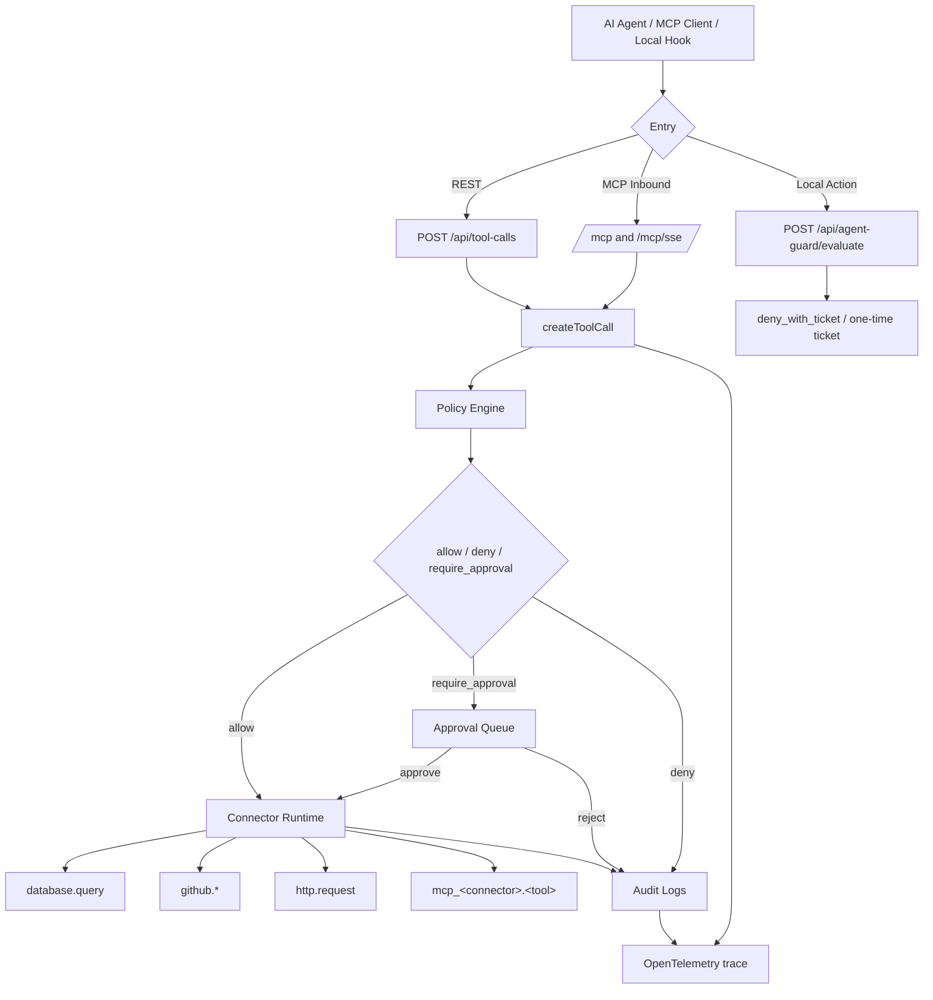

<div align="center">


# AgentToolGate

<p>
  <a href="https://github.com/aki0225/AgentToolGate/actions/workflows/ci.yml"></a>
  
  
  <a href="https://github.com/aki0225/AgentToolGate/releases"></a>
  <a href="LICENSE"></a>
</p>

**[架构总览](#架构总览)** ·
**[快速开始](#快速开始)** ·
**[防护范围](#防护范围)** ·
**[非目标](#非目标)** ·
**[已知限制](#已知限制)** ·
**[深入文档](#深入文档)** ·
**[支持工具](#支持工具)**

</div>

AgentToolGate（下面简称 ATG）是一个跑在本地的 AI Agent 工具调用治理网关。它不做“防注入”，只管一件事——数据库、GitHub、HTTP、外部 MCP 和本地高危动作在真正执行之前，先过 policy、审批、密钥注入和审计这一道。

> [!IMPORTANT]
> ATG 是 guardrail，不是操作系统沙箱，也不是 EDR 或企业 DLP。真要跑高风险场景，最小权限账户、系统沙箱、网络策略和上游服务自己的权限边界仍然缺一不可，ATG 替代不了它们。

## 架构总览



图里几条主线：

- REST 主链路是 `POST /api/tool-calls -> createToolCall -> Policy / Approval / Audit / Connector Runtime / OTel`。
- MCP Inbound 提供 Streamable HTTP `/mcp`，SSE `/mcp/sse` 做 fallback。`tools/call` 走的也是 `createToolCall`，没有旁路。
- MCP Outbound 把外部 MCP Server 的工具同步成 `mcp_<connector>.<tool>`，进同一条治理链路。
- 本地动作防火墙走独立入口 `/api/agent-guard/evaluate`，对 Claude / Codex 的本地动作做风险分类、审计和 `deny_with_ticket` 闭环。

## 快速开始

从 [GitHub Release](https://github.com/aki0225/AgentToolGate/releases) 下载 Windows amd64 或 Linux amd64 包，解压后在要保护的项目根目录运行：

```powershell
# Windows
.\agenttoolgate.exe doctor
.\agenttoolgate.exe --open

# Codex 用户
.\agenttoolgate.exe init codex
.\agenttoolgate.exe up --open

# Claude Code 用户
.\agenttoolgate.exe init claude
.\agenttoolgate.exe up --open

# 同时使用两个客户端
.\agenttoolgate.exe init all
.\agenttoolgate.exe up --open
```

Linux 用不带 `.exe` 的 `./agenttoolgate`，参数一样。`init` 只在项目里生成 `.agenttoolgate/` 配置和客户端片段，不碰全局的 Codex / Claude Code 配置，也不碰系统策略、注册表和 shell profile。hook 默认 `dry-run`，不会一上来就真阻断。

也可以从源码构建单二进制（需要 Go 1.26+ 与 Node.js 20+）：

```powershell
pwsh -NoProfile -ExecutionPolicy Bypass -File .\scripts\build-local.ps1
.\dist\agenttoolgate.exe doctor
```

日常使用说明见 [docs/local-daily-use.md](docs/local-daily-use.md)，AI 客户端接入见 [docs/ai-client-integration.md](docs/ai-client-integration.md)。

## 生产部署前必读

仓库默认 `docker-compose.yml` 使用 `HOST=0.0.0.0`、`AUTH_MODE=local`、
`LOCAL_ROLE=owner` 和 `DEV_MODE=true`。这套配置只用于单机本地开发：
任何能够访问 backend 的调用方都会进入本地 owner 身份，不能直接作为多用户、
共享主机或网络暴露部署的鉴权方案。

如果要让其他机器或其他用户访问，至少需要切换到 OIDC、限制监听地址和网络入口，
并为上游凭据配置最小权限。不要把默认 Compose 配置直接暴露到公网。
否则请求等同于无鉴权访问。当前项目不宣称已提供企业级 RBAC、职责分离或
组织级访问控制。

## 防护范围

两个入口：

- **工具治理网关**：`database.query`、`github.*`、`http.request`、`mcp_<connector>.<tool>` 在执行前过 workspace policy、审批、限流、密钥注入、脱敏审计和 OTel trace。
- **本地动作防火墙**：Claude / Codex 要写 Startup、`.ssh`、`.env`、`.git/hooks` 或 ATG 自身的 hook/config，或者脚本里出现 `ExecutionPolicy Bypass`、`WindowStyle Hidden`、encoded payload 这类特征时，先进 guard 评估。

拦的是这类后果：

- 写操作、高风险工具没经审批就打到 GitHub、HTTP、数据库或外部 MCP。
- Agent 直接拿到或回显上游 token、Authorization header、cookie、DSN 密码、MCP session。
- 被注入之后写持久化脚本、改 git hooks、摸凭据路径、破坏项目文件。
- 审批、拒绝、失败和执行结果没有留痕，出了事查不了。

## 非目标

- 提示词注入、幻觉、恶意上下文本身，ATG 不拦——它只管工具调用落地那一刻。
- 不做 OS 级 enforcement：Claude Code 侧可以保留 ask/confirm 心智，但它仍然只是 hook guardrail。

## 已知限制

- Codex hook bridge 没有完整的交互式 ask 体验，需要确认的动作目前按保守 `deny` / no-op 处理，不能当成完整的审批弹窗。
- Secret 目前是 env-backed `valueRef`，不是 KMS、Vault 或云 Secret Manager。
- GitHub 集成适合 PAT / demo token，不是 GitHub App installation token 的生产闭环。
- HTTP 的 SSRF guard 还没覆盖 DNS rebinding、解析后私网网段判定和 redirect 后的 DNS 复检。
- RBAC、版本化迁移、备份、告警、SLO、灾备和组织级策略发布/回滚，这些生产化前提都还没有。

## 深入文档

- [架构说明](docs/architecture.md)：项目定位、REST/MCP/Local Action 主链路、核心模块、数据流与信任边界。
- [MCP 治理](docs/mcp-governance.md)：MCP Inbound `/mcp` / `/mcp/sse`、MCP Outbound `mcp_<connector>.<tool>`、Secret/Connector/Approval 关系。
- [本地动作防火墙](docs/local-action-firewall.md)：off / dry-run / live、`deny_with_ticket`、remembered allow、Claude / Codex 差异和 TOCTOU 风险。
- [威胁模型](docs/threat-model.md)：资产、攻击面、可信边界、关键攻击路径、已有缓解和未覆盖项。
- [演示剧本](docs/demo-playbook.md)：产品化演示路径。
- [安全评审说明](docs/security-review-notes.md)：安全评审视角的控制与剩余风险。
- [Daily Use Acceptance](docs/daily-use-acceptance.md)：日常开发低噪音验收证据。
- [Agent Guard Synthetic Demo](examples/agent-demo/windows-startup-poisoning.md)：Windows Startup poisoning synthetic demo。
- [Secret 外传 Synthetic Demo](examples/agent-demo/secret-exfiltration-blocked.md)：本机验证危险 header 阻断与响应脱敏。
- [GitHub 写审批 Synthetic Demo](examples/agent-demo/github-write-approval.md)：本机验证审批前不触达上游和独立 reviewer 放行。

## 支持工具

| Tool Registry 工具族 | 当前治理行为 |
| --- | --- |
| `mock.echo` | 最小成功闭环，写 audit |
| `database.query` | SELECT-only、表白名单、LIMIT、timeout、敏感字段脱敏 |
| `github.*` | repo allowlist、后端 Secret 注入、写操作 approval |
| `http.request` | host allowlist、SSRF guard、method 派生审批、header/body/output 脱敏 |
| `mcp_<connector>.<tool>` | 外部 MCP 工具同步后纳入 Tool Registry；读工具可直通，写/未知/破坏性工具 approval |

本地动作防火墙不在这张表里——它走独立入口 `POST /api/agent-guard/evaluate`，给 Claude / Codex hook 做本地动作的风险分类、解释、审计和一次性 approval ticket，不是普通的 Tool Registry 工具。

## 技术栈

| 层 | 技术栈 |
| --- | --- |
| Backend | Go, chi, pgxpool, slog, OpenTelemetry |
| Frontend | React, TypeScript, Vite, Tailwind CSS, shadcn/ui |
| Storage | SQLite, PostgreSQL, MemoryStore |
| Protocol | REST, MCP Streamable HTTP, MCP SSE fallback |
| Policy | YAML defaults + workspace-managed policy rules |

## 本地验证

文档级检查：

```powershell
git diff --check
```

后端：

```powershell
cd backend
go test -count=1 -timeout 60s ./...
go vet ./...
```

前端：

```powershell
cd frontend
npm run check
npm run build
```

## License

MIT. See [LICENSE](./LICENSE).
