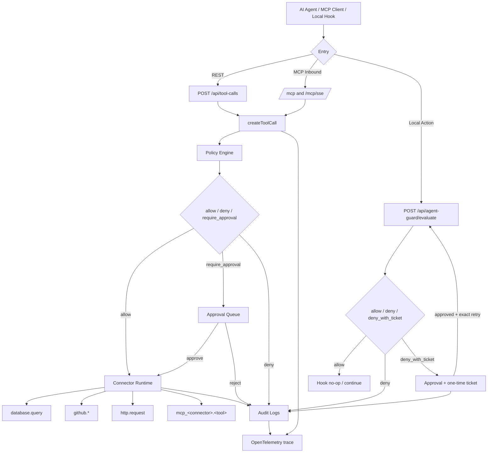

<div align="center">


# AgentToolGate

<p>
  <a href="https://github.com/aki0225/AgentToolGate/actions/workflows/ci.yml"></a>
  
  
  <a href="https://aki0225.github.io/AgentToolGate/"></a>
  <a href="https://github.com/aki0225/AgentToolGate/releases"></a>
  <a href="LICENSE"></a>
</p>

**[架构总览](#架构总览)** ·
**[快速开始](#快速开始)** ·
**[当前状态](#当前状态)** ·
**[在线展示](https://aki0225.github.io/AgentToolGate/)** ·
**[实测评估](#实测评估)** ·
**[防护范围](#防护范围)** ·
**[非目标](#非目标)** ·
**[已知限制](#已知限制)** ·
**[深入文档](#深入文档)** ·
**[支持工具](#支持工具)**

</div>

AgentToolGate（下面简称 ATG）是一个跑在本地的 AI Agent 工具调用治理网关。它不做“防注入”，只管一件事——数据库、GitHub、HTTP、外部 MCP 和本地动作在真正执行之前，先进入各自的治理入口，按需经过 policy、硬护栏、审批和 ATG 管理的 Connector Secret 解析，并留下脱敏审计。

> [!IMPORTANT]
> ATG 是 guardrail，不是操作系统沙箱，也不是 EDR 或企业 DLP。真要跑高风险场景，最小权限账户、系统沙箱、网络策略和上游服务自己的权限边界仍然缺一不可，ATG 替代不了它们。

## 架构总览


```mermaid
flowchart TD
    Agent[AI Agent / MCP Client / Local Hook] --> Entry{Entry}
    Entry -->|REST| REST[POST /api/tool-calls]
    Entry -->|MCP Inbound| MCPIn[/mcp and /mcp/sse/]
    Entry -->|Local Action| Guard[POST /api/agent-guard/evaluate]
    MCPIn --> ToolCall[createToolCall]
    REST --> ToolCall
    ToolCall --> Policy[Policy Engine]
    Policy --> Decision{allow / deny / require_approval}
    Decision -->|allow| Runtime[Connector Runtime]
    Decision -->|require_approval| Approval[Approval Queue]
    Decision -->|deny| Audit[Audit Logs]
    Approval -->|approve| Runtime
    Approval -->|reject| Audit
    Runtime --> DB[database.query]
    Runtime --> GitHub[github.*]
    Runtime --> HTTP[http.request]
    Runtime --> MCPOut["mcp_&lt;connector&gt;.&lt;tool&gt;"]
    Runtime --> Audit
    Guard --> GuardDecision{allow / deny / deny_with_ticket}
    GuardDecision -->|allow| HookContinue[Hook no-op / continue]
    GuardDecision -->|deny| Audit
    GuardDecision -->|deny_with_ticket| Ticket[Approval + one-time ticket]
    Ticket --> Audit
    Ticket -->|approved + exact retry| Guard
    ToolCall --> Trace[OpenTelemetry trace]
    Audit --> Trace
```

图里几条主线：

- REST 主链路是 `POST /api/tool-calls -> createToolCall -> Policy / Approval / Audit / Connector Runtime / OTel`。
- MCP Inbound Streamable HTTP 使用 `/mcp`，SSE `/mcp/sse` 仅作 fallback。`tools/call` 走的也是 `createToolCall`，没有旁路。
- MCP Outbound 把外部 MCP Server 的工具同步成 `mcp_<connector>.<tool>`，进同一条治理链路。
- 本地动作防火墙走独立入口 `/api/agent-guard/evaluate`。安全动作直接放行，明确危险动作直接拒绝，只有需要人工判断的动作才创建一次性 `deny_with_ticket`。

## 快速开始

从 [GitHub Release](https://github.com/aki0225/AgentToolGate/releases) 下载 Windows amd64 或 Linux amd64 包，解压后在要保护的项目根目录运行：

当前稳定版 `v0.4.2` 已提供 `init codex`、配套 `doctor` 检查、项目 TOML、自包含
Hook 和项目内保护规则。请从 GitHub Release 下载正式包；`v0.3.0` 的旧接入方式只保留用于历史版本。

如果普通 serve 已通过 `agenttoolgate.exe --open` 等方式运行，先在原终端按 `Ctrl+C` 停止，再执行下面的项目初始化流程；否则 `up` 会与原进程争用默认 `8080` 端口。

```powershell
# Codex 用户
.\agenttoolgate.exe init codex

# Claude Code 用户
.\agenttoolgate.exe init claude

# 同时使用两个客户端
.\agenttoolgate.exe init all

# 从上面三种 init 中任选一种，然后只用 up 启动
.\agenttoolgate.exe up --open

# up 运行后，在另一个终端检查项目接入
.\agenttoolgate.exe doctor --dir .
```

Linux 用不带 `.exe` 的 `./agenttoolgate`，参数一样。`init codex` 和 `init all` 要求当前目录本身就是目标 Git 仓库根目录；不能在普通目录或外层仓库的任意子目录中安装。初始化会在项目中生成 `.codex/config.toml`、自包含的 `.codex/hooks/` 和 `.agenttoolgate/` 配置，但不会修改用户级 `~/.codex/config.toml`，也不会替你信任项目或 Hook。Codex 用户还需要：

1. 按键合并 `.agenttoolgate/clients/codex.config.snippet.toml` 到用户级 Codex 配置，不要重复追加已有的 `[features]` 或 `[mcp_servers.agenttoolgate]` 表。
2. 从该项目启动 Codex，在 `/hooks` 中核对 Hook 命令和当前 Hash，再显式信任。
3. 用 `agenttoolgate.exe doctor --dir <project>` 核对项目配置和 Hook 文件；`doctor` 不会替代 Codex 运行时的信任检查。

如果项目已有 `.codex/hooks.json`，普通 `init codex` 会在写入前停止，避免它和 `.codex/config.toml` 的 Hook 被同层重复加载；请先人工保留一种来源。继续使用 JSON 时可用 `agenttoolgate.exe init codex --refresh-hooks --dir <project>` 单独安装或更新 adapter/Core，不会创建项目 TOML。ATG 会在目标 Git 仓库的本地 `info/exclude` 中按需追加 `/.tmp/agenttoolgate/` 和 `/.tmp/local-action-firewall/`，不改项目 `.gitignore`，并避免 control、recovery 和 pending audit 污染 `git status`。刷新会把旧运行文件保留到 `.tmp/agenttoolgate/` 并打印路径；确认新 Hook 稳定后再手工清理。随后重新运行 `up` 发布本次 endpoint 和二进制路径，再在 `/hooks` 中复核信任状态。

项目 Hook 需要 Git 与 Python 3.10+。Windows 优先使用 `python`，不可用时支持
`py -3`；Linux / macOS 使用 `python3`。hook 默认 `dry-run`，不会一上来就真阻断。
Full Access 模式本身不会禁用已加载的 Hook，但这不等于完整保护：只有 Hook 已启用并
信任、ATG 处于 `live`、调用进入 Codex 支持的 `PreToolUse` 路径，且 Hook 成功返回
有效 `deny` 或合法退出码 `2` 时，动作才会被实时阻断。Hook 被禁用或绕过、处于
`off` / `dry-run`，以及未覆盖的工具路径，都应视为没有 ATG 实时阻断。`live`
模式下无法解析的 Hook 输入会保守拒绝；完整步骤见
[AI 客户端接入指南](docs/ai-client-integration.md#51-启用项目级本地动作-hook)。

可以从任意目录精确控制目标项目：

```powershell
.\agenttoolgate.exe hook control status --dir <project>
.\agenttoolgate.exe hook control live --dir <project> --reason "enable guarded session"
.\agenttoolgate.exe hook control off --dir <project> --reason "pause ATG hooks"
```

该命令切换的是当前运行时 control。输出中的 `nextUpMode` 表示下一次 `up` 会从
`.agenttoolgate/config.json` 读取的模式；两者不一致时 CLI 会明确警告。项目级服务
正常停止时，只有 control 仍与本进程发布内容一致才会切到 `off`；若先前的 `up`
实例仍可达，则恢复该实例。异常退出可能留下指向不可达 endpoint 的 `live` control，
此时 Hook 走离线保守路径，`doctor` 会显示 unreachable；可显式执行
`hook control off --dir <project>` 恢复开发。

AgentToolGate 不碰系统策略、注册表或 shell profile。Claude Code 的配置仍由用户显式接入。

`init` 同时生成 `.agenttoolgate/protected.json`。默认规则为空，不改变普通开发行为；你可以把核心算法、生产配置等 repo-relative 路径设置为“读取/修改需审批”或“直接拒绝”，也可以对 Hook 可见的网络写入增加项目级 host allowlist。规则只会收紧 Guard Core，不会把原本需要审批的动作改成静默放行。配置示例与边界见 [本地日常使用指南](docs/local-daily-use.md#配置项目内保护规则)。

也可以从源码构建单二进制（需要 Go 1.26+ 与 Node.js 20.x）：

```powershell
pwsh -NoProfile -ExecutionPolicy Bypass -File .\scripts\build-local.ps1
.\dist\agenttoolgate.exe doctor
```

日常使用说明见 [docs/local-daily-use.md](docs/local-daily-use.md)，AI 客户端接入见 [docs/ai-client-integration.md](docs/ai-client-integration.md)。

## 当前状态

- 当前稳定版是 [`v0.4.2`](https://github.com/aki0225/AgentToolGate/releases/tag/v0.4.2)，
  产品提交为 `30be1cc2c99bda7e7013ca7f70f30bae47ee8421`。
- 产品提交的
  [CI run 31991113892](https://github.com/aki0225/AgentToolGate/actions/runs/31991113892)
  和双平台
  [Release run 31991881698](https://github.com/aki0225/AgentToolGate/actions/runs/31991881698)
  均已成功。
- 正式 Release 包含 Windows / Linux 主程序包、对应评估包和 `SHA256SUMS`；workflow
  已完成构建、smoke、上传和 GitHub digest 校验。
- `v0.4.2` 修复 Python 3.14 下含 NUL 工作目录的 Hook 异常路径，不改变正常 Guard
  决策；正式附件已独立下载并完成 Windows 主程序与 quick 评估复验。
- 最新状态、已验证能力和维护边界见
  [当前项目状态](docs/current-status.md)；发布级证据见
  [v0.4.2 发布验收](docs/v0.4.2-release-acceptance.md)，稳定版、发布门禁和历史
  快照的统一入口见 [证据索引](docs/evidence-index.md)。

## 生产部署前必读

默认 Compose 在容器内使用 `HOST=0.0.0.0`，但宿主端口只映射到
`127.0.0.1:8080`。`AUTH_MODE=local` 不验证 Bearer token，并默认以
`LOCAL_ROLE=owner` 处理请求；`DEV_MODE` 不是认证或授权开关。只要 backend 被其他
调用方访问，这套 local 配置就等同于无鉴权的 owner 访问。

任何多用户、共享主机或网络暴露部署都必须启用 OIDC，放在可信网络边界内，并为上游
凭据配置最小权限。审批接口允许 `owner`、`admin`、`approver` 角色操作，请求者不可
自批；local 模式可选配置独立 reviewer token，但这仍不是组织级强职责分离。

<!-- agent-safety-proof:start -->
## 实测评估

基于 [`v0.4.1`](https://github.com/aki0225/AgentToolGate/releases/tag/v0.4.1) 正式评估附件，在
[GitHub Actions run 31954428232](https://github.com/aki0225/AgentToolGate/actions/runs/31954428232) 的原生 Windows / Linux runner
复跑；Release 产品提交为
[`4386852`](https://github.com/aki0225/AgentToolGate/commit/43868521e56c85cf074e92f572daff49121651b9)：

- **Quick（Linux）**：20 passed / 0 failed / 0 skipped。
- **Windows full**：30 passed / 0 failed / 0 skipped。
- **Linux full**：26 passed / 0 failed / 4 skipped。

数字由 [版本化公开证据](evaluation/published/agent-safety/releases/v0.4.1/proof.json) 的逐 case 状态计算；同一文件绑定 Release
附件 digest、workflow provenance、Artifact ID 与源文件 SHA256。它不是 OS sandbox
证明，也不替代真实 Codex / Claude Code 客户端验收。
<!-- agent-safety-proof:end -->

上面是当前最新的完整 30-case 双平台版本化 Proof Pack，仍冻结在 `v0.4.1`。
`v0.4.2` 已完成原生双平台 quick 和公开附件独立复验，但没有把 `v0.4.1` 的完整结果
改名为新版本证据。

本次固定 synthetic suite 的良性中断率为：Quick Linux 25%，Windows full 16.7%，
Linux full 16.7%。该数字只描述评估用例，不等于真实日常开发的误拦率。

### 证据分层

- **统一索引**：[证据索引](docs/evidence-index.md)区分当前稳定版证据、现行发布门禁和
  历史版本快照。
- **正式发布验收**：[v0.4.2 发布验收](docs/v0.4.2-release-acceptance.md)记录正式标签、
  产品提交 CI、双平台 Release workflow、五个附件及当前验证边界。
- **上一稳定版完整评估**：[v0.4.1 发布验收](docs/v0.4.1-release-acceptance.md)
  保留正式附件的 Quick、Windows full、Linux full 复跑与版本化 Proof Pack。
- **上一版本验收**：[v0.4.0 发布验收](docs/v0.4-release-acceptance.md)保留
  `v0.4.0` 的产品 CI、双平台 Release 和独立附件验证。
- **历史稳定版验收**：[v0.3.2 发布验收](docs/v0.3.2-release-acceptance.md)保留
  `v0.3.2` 的双平台 Release、正式附件和五场景真实 Codex CLI 验收。
- **候选发布验收**：[v0.3.1-rc1 发布验收](docs/v0.3.1-rc1-release-acceptance.md)
  记录新版 Codex 项目 Hook 接入、真实附件 SHA256、Windows allow/deny 后置条件和
  30-case 评估复跑结果。
- **v0.3.1 产品提交真实 Codex CLI 验收（历史）**：
  [v0.3.1-rc1 Codex CLI 验收](docs/v0.3.1-rc1-codex-cli-acceptance.md)记录项目与 Hook
  两层信任、非 trust bypass 的真实调用、MCP Audit、高危写入拒绝和独立后置条件；
  RC 与正式版指向同一产品提交。
- **真实客户端验收**：[Codex CLI 与 Claude Code 验收](evaluation/client-acceptance/README.md)
  保存 MCP Audit、Hook 生命周期、文件系统后置条件和同步脱敏录屏。该证据来自历史源提交
  `0ee86ef`，用于证明历史双客户端集成路径，不冒充 `v0.3.1` Release 二进制重跑。
- **可重复评估**：`v0.4.2` Release 同时提供 Windows / Linux 评估附件，可在
  disposable 目录复跑 quick 或完整 suite。

## 防护范围

两个入口：

- **工具治理网关**：`database.query`、`github.*`、`http.request`、`mcp_<connector>.<tool>` 进入 `createToolCall` 后执行 workspace policy、硬校验和限流，仅在需要时创建审批。GitHub / HTTP / MCP 的 Secret 引用会在审批创建前做 fail-closed 校验，真正执行时重新解析并注入，结果进入脱敏审计和 OTel trace。
- **本地动作防火墙**：Claude / Codex 要写 Startup、`.ssh`、`.env`、`.git/hooks` 或 ATG 自身的 hook/config，或者脚本里出现 `ExecutionPolicy Bypass`、`WindowStyle Hidden`、encoded payload 这类特征时，先进 guard 评估。
- **项目内保护规则**：`.agenttoolgate/protected.json` 可为核心目录配置 read / write / delete / exec 的 `require_approval` 或 `deny`，并对未列出的网络写入目标继续收紧。

拦的是这类后果：

- 写操作、高风险工具没经审批就打到 GitHub、HTTP、数据库或外部 MCP。
- Agent 直接拿到或回显上游 token、Authorization header、cookie、DSN 密码、MCP session。
- 被注入之后写持久化脚本、改 git hooks、摸凭据路径、破坏项目文件。
- 审批、拒绝、失败和执行结果没有留痕，出了事查不了。

## 非目标

- 提示词注入、幻觉、恶意上下文本身，ATG 不拦——它只管工具调用落地那一刻。
- 不做 OS 级 enforcement：Claude Code 侧可以保留 ask/confirm 心智，但它仍然只是 hook guardrail。
- 不做数据血缘或污点追踪：规则能约束“读取哪个路径”和“写到哪个 host”，不能证明先前读出的源码不会被改名、编码或通过绕过 Hook 的进程外传。

## 已知限制

- Codex hook bridge 没有完整的交互式 ask 体验：Guard `allow` 是零输出 no-op，`ask` 和 `deny_with_ticket` 在运行时保守映射为 `deny`，不能当成完整的审批弹窗。
- ATG 管理的 Connector Secret 目前是 env-backed `valueRef`，不是 KMS、Vault 或云 Secret Manager。
- GitHub 集成适合 PAT / demo token，不是 GitHub App installation token 的生产闭环。
- HTTP / MCP 出站已按请求和重定向重新解析 DNS、拒绝 metadata/link-local/非显式
  loopback，并固定拨号到已校验 IP；但显式 allowlist authority 仍可解析到普通
  RFC1918、ULA 或 CGNAT 私网地址，因此不是完整的私网隔离或 DNS rebinding 防护。
- 项目规则只覆盖 Hook 暴露的显式目标及当前可静态解析的已知命令、解释器和脚本后缀；动态命令、未知解释器或绕过 Hook 的进程不保证命中。
- 当前有基础 role/workspace 隔离、`owner/admin/approver` 审批角色、自批保护和可选 local reviewer token；仍缺组织级强职责分离、版本化迁移、备份、告警、SLO、灾备和策略发布/回滚。

## 深入文档

- [当前项目状态](docs/current-status.md)：稳定版本、维护基线、已验证能力和后续变更边界。
- [证据索引](docs/evidence-index.md)：当前稳定版证据、发布门禁和历史快照入口。
- [架构说明](docs/architecture.md)：项目定位、REST/MCP/Local Action 主链路、核心模块、数据流与信任边界。
- [MCP 治理](docs/mcp-governance.md)：MCP Inbound Streamable HTTP `/mcp`、SSE fallback `/mcp/sse`、MCP Outbound `mcp_<connector>.<tool>`、ATG 管理的 Connector Secret 与 Connector、Approval 的关系。
- [本地动作防火墙](docs/local-action-firewall.md)：off / dry-run / live、`deny_with_ticket`、remembered allow、Claude / Codex 差异和 TOCTOU 风险。
- [威胁模型](docs/threat-model.md)：资产、攻击面、可信边界、关键攻击路径、已有缓解和未覆盖项。
- [演示剧本](docs/demo-playbook.md)：产品化演示路径。
- [安全评审说明](docs/security-review-notes.md)：安全评审视角的控制与剩余风险。
- [Daily Use Acceptance](docs/daily-use-acceptance.md)：2026-07 历史日常使用验收；当前
  `live` 基线对 `go test` / `npm run check` 的决策以
  [本地动作防火墙](docs/local-action-firewall.md)为准。
- [v0.4.2 发布验收](docs/v0.4.2-release-acceptance.md)：当前稳定版的产品 CI、双平台 Release、正式附件 digest 和 Python 3.14 兼容补丁范围。
- [v0.4.1 发布验收](docs/v0.4.1-release-acceptance.md)：上一稳定版的完整双平台评估复跑与版本化 Proof Pack。
- [v0.4.0 发布验收](docs/v0.4-release-acceptance.md)：上一版本的产品 CI、双平台 Release、正式附件 SHA256 和日常使用加固验收。
- [v0.3.2 发布验收](docs/v0.3.2-release-acceptance.md)：历史稳定版的双平台 Release、正式附件和五场景真实 Codex 证据。
- [v0.3.1 发布验收](docs/v0.3.1-release-acceptance.md)：历史稳定版的双平台 Release、正式附件和真实 Codex 接入证据。
- [v0.3.0 发布验收](docs/v0.3.0-release-acceptance.md)：项目保护规则、跨平台评估附件和正式 Release 的可追溯验收记录。
- [v0.3.1-rc1 发布验收](docs/v0.3.1-rc1-release-acceptance.md)：Codex 项目 Hook 接入候选版的真实下载、运行和评估记录。
- [Agent Guard Synthetic Demo](examples/agent-demo/windows-startup-poisoning.md)：Windows Startup poisoning synthetic demo。
- [ATG 管理的 Connector Secret 外传 Synthetic Demo](examples/agent-demo/secret-exfiltration-blocked.md)：本机验证这类 Secret 不直接暴露给 Agent，并对危险 header 与响应做脱敏。
- [GitHub 写审批 Synthetic Demo](examples/agent-demo/github-write-approval.md)：本机验证审批前不触达上游和独立 reviewer 放行。

## 支持工具

| Tool Registry 工具族 | 当前治理行为 |
| --- | --- |
| `mock.echo` | 最小成功闭环，写 audit |
| `database.query` | SELECT-only、表白名单、LIMIT、timeout、敏感字段脱敏 |
| `github.*` | repo allowlist、ATG 管理的 Connector Secret 运行时注入、写操作 approval |
| `http.request` | host allowlist、SSRF guard、method 派生审批、header/body/output 脱敏 |
| `mcp_<connector>.<tool>` | 外部 MCP 工具同步后纳入 Tool Registry；读工具可直通，写/未知/破坏性工具 approval |

本地动作防火墙不在这张表里——它走独立入口 `POST /api/agent-guard/evaluate`，给 Claude / Codex hook 做本地动作的风险分类、解释、审计和一次性 approval ticket，不是普通的 Tool Registry 工具。

## 技术栈

| 层 | 技术栈 |
| --- | --- |
| Backend | Go, chi, pgxpool, slog, OpenTelemetry |
| Frontend | React, TypeScript, Vite, Tailwind CSS, shadcn/ui |
| Storage | SQLite, PostgreSQL, MemoryStore |
| Protocol | REST, MCP Inbound Streamable HTTP, MCP Inbound SSE fallback |
| Policy | YAML defaults + workspace-managed policy rules |

## 本地验证

文档级检查：

```powershell
git diff --check
```

后端：

```powershell
cd backend
go test -count=1 -timeout 60s ./...
go vet ./...
```

前端：

```powershell
cd frontend
npm run check
npm run build
```

## License

MIT. See [LICENSE](./LICENSE).
