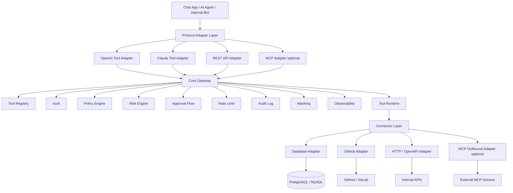

# AgentToolGate 架构文档

> 版本：v0.1<br>
> 日期：2026-06-03<br>
> 目标：做一个适合开源、适合简历展示、也具备企业落地价值的 AI Agent 工具调用网关。
> 技术倾向：Go 后端优先，React/Vue 管理台，PostgreSQL，Docker Compose，一期避免过度复杂化。

---

## 1. 背景

最近 AI Agent、vibe coding、tool use、function calling、MCP 这些概念都很火，但真正落到企业里时，问题不是“模型能不能调用工具”，而是：

- Agent 能不能安全访问数据库？
- Agent 能不能安全访问 GitHub / GitLab / Jira / CI/CD？
- Agent 能不能调用内部 HTTP API / OpenAPI？
- 模型调用工具之前，谁来做权限控制？
- 写操作要不要审批？
- 工具调用有没有审计日志？
- 工具输出里有没有敏感信息？
- 调用失败、超时、限流、误操作怎么排查？
- 不同模型厂商的 tool calling 格式怎么统一？
- MCP Server 能不能纳入统一治理，而不是每个客户端各连各的？

OpenAI 的 function calling 文档把 tool calling 定义为让模型连接外部系统、访问训练数据之外的数据和应用动作的机制；Claude 的 tool use 也是让模型根据工具描述决定是否调用工具，然后由应用侧或服务端执行工具。MCP 则是另一种标准化方式，让 server 暴露可由模型调用的 tools，例如查询数据库、调用 API 或执行计算。

所以这个项目不应该定位成“再做一个 MCP Server”，而应该定位成：

```text
AgentToolGate = 面向企业 AI Agent 的工具调用网关

把数据库、GitHub、内部 API、MCP Server 等企业能力，
统一包装成可控、可审计、可审批、可限流、可观测的 AI Agent Tool。
```

---

## 2. 项目定位

### 2.1 一句话定位

**AgentToolGate 是一个 Enterprise Tool Gateway for AI Agents。**

它负责把企业内部系统包装成大模型可调用的工具，同时提供统一的治理能力：

- Tool Registry：工具注册与发现
- Tool Runtime：工具执行运行时
- Policy Engine：权限策略
- Approval Flow：高风险操作审批
- Audit Log：工具调用审计
- Rate Limit：限流与配额
- Data Masking：敏感信息脱敏
- Observability：链路追踪、指标、日志
- Connector SDK：连接器扩展机制
- Model Adapter：适配 OpenAI / Claude / 其他模型的 tool calling 格式
- MCP Adapter：可选支持 MCP inbound / outbound

### 2.2 项目不是什么

它不是：

- 不是完整 Agent 框架
- 不是 Dify / Flowise 这种低代码 AI 应用平台
- 不是 LangChain 替代品
- 不是纯 MCP Server
- 不是 BI 平台
- 不是 CI/CD 平台
- 不是代码审查平台
- 不是数据库管理工具
- 不是让 Agent 直接拥有生产权限的自动执行系统

它要解决的核心问题是：

```text
Agent Framework 负责“模型想做什么”；
AgentToolGate 负责“能不能做、怎么安全地做、做完怎么追责”。
```

---

## 3. 为什么 MCP 只是顺带支持

MCP 很适合作为一种标准化工具协议，但它不应该成为 AgentToolGate 的核心绑定点。

原因：

1. 企业真正需要的是安全访问数据库、GitHub、内部 API、CI/CD，而不是为了 MCP 而 MCP。
2. 主流模型厂商已经有自己的 tool/function calling 格式，企业应用需要统一抽象。
3. MCP Server 生态质量参差不齐，直接让客户端连接多个 MCP Server 会带来权限、审计和安全风险。
4. 项目如果只叫 MCP Gateway，会被协议热度绑定；如果叫 Agent Tool Gateway，则更长期。
5. 即使未来 MCP 变化，数据库、GitHub、OpenAPI、tool calling 的治理需求仍然存在。

因此本项目架构应当是：

```text
核心：Tool Registry / Runtime / Policy / Approval / Audit / Connector SDK
协议：OpenAI tools / Claude tools / REST / MCP
连接器：Database / GitHub / OpenAPI / Internal API / MCP Server
```

MCP 的角色：

```text
1. MCP Inbound：
   AgentToolGate 对外表现为 MCP Server，供 MCP Client 调用网关里的工具。

2. MCP Outbound：
   AgentToolGate 作为 MCP Client 接入外部 MCP Server，把它们纳入统一权限、审计、审批和脱敏体系。
```

但一期 MVP 可以不做 MCP，把 MCP 放到 v0.2 或 v0.3。

---

## 4. 实际要落地的东西

### 4.1 一期 MVP 目标

两个月内做出一个能跑、能演示、能开源、能写进简历的版本。

一期重点只做这条闭环：

```text
模型 / Chat App
  -> AgentToolGate
  -> 权限策略
  -> 审批 / 审计 / 脱敏 / 限流
  -> PostgreSQL / GitHub / HTTP API
  -> 返回结果
```

### 4.2 一期要支持的 3 类工具

#### 1. Database Tool

先支持 PostgreSQL，只做只读查询。

核心能力：

- 数据源注册
- schema introspection
- 表白名单
- 字段脱敏
- SQL Guard
- 查询超时
- 自动 LIMIT
- 只读账号
- 查询审计
- 调用 trace

典型 demo：

```text
用户：帮我查一下最近 7 天订单数量和总金额。

Agent 调用 database.query
AgentToolGate 检查 SQL 是否安全
只允许 SELECT
只允许访问白名单表
结果脱敏后返回
审计日志记录本次调用
```

#### 2. GitHub Tool

先支持 GitHub PR / Issue 相关工具。

核心能力：

- GitHub App 或 PAT Demo 接入
- repo allowlist
- 读取 repo 信息
- 读取 PR 信息
- 获取 PR diff / files
- 总结 PR
- 创建 Issue
- 评论 PR
- 写操作审批
- GitHub API rate limit 处理
- 调用审计

典型 demo：

```text
用户：帮我总结 org/demo 仓库 #18 这个 PR 改了什么，有没有风险。

Agent 调用 github.get_pull_request
Agent 调用 github.get_pr_files
AgentToolGate 记录调用日志和 trace
模型基于结果生成总结
```

另一个 demo：

```text
用户：帮我创建一个 GitHub Issue。

Agent 调用 github.create_issue
AgentToolGate 判断这是写操作
返回 approval_required
管理员在控制台审批
审批通过后真正创建 Issue
```

#### 3. HTTP / OpenAPI Tool

先支持简单 HTTP API 注册，后续再支持完整 OpenAPI 导入。

核心能力：

- 注册内部 API 工具
- 配置 method、path、headers、body schema
- GET 默认低风险
- POST/PUT/PATCH/DELETE 默认需要审批
- endpoint allowlist
- 请求输出脱敏
- timeout
- audit log

典型 demo：

```text
用户：帮我查一下订单 123 的状态。

Agent 调用 internal_api.get_order
AgentToolGate 检查权限
调用内部 HTTP API
脱敏后返回结果
```

---

## 5. 核心场景

### 场景一：安全查询数据库

```text
用户自然语言问题
  -> 模型选择 database.query
  -> AgentToolGate 接收 ToolCallRequest
  -> SQL Guard 检查
  -> Policy Engine 检查表权限
  -> 使用只读账号执行 SQL
  -> 结果脱敏
  -> 写入 audit log
  -> 返回结果给模型总结
```

要体现的价值：

```text
不是简单 Text-to-SQL，而是企业可控的 Text-to-SQL。
```

### 场景二：GitHub PR 总结

```text
用户要求总结 PR
  -> 模型调用 github.get_pull_request
  -> 模型调用 github.get_pr_files
  -> AgentToolGate 统一鉴权、限流、审计
  -> 返回 PR 信息
  -> 模型总结变更点、风险点、测试建议
```

要体现的价值：

```text
Agent 可以访问研发系统，但所有访问都经过网关。
```

### 场景三：创建 Issue / 评论 PR 前审批

```text
用户要求创建 Issue 或评论 PR
  -> 模型调用 github.create_issue / github.comment_pr
  -> Policy Engine 判断为 write operation
  -> 返回 approval_required
  -> 管理员在控制台审批
  -> 审批通过后执行
  -> 写入 audit log
```

要体现的价值：

```text
Agent 不是不能做写操作，而是写操作必须可控、可审计、可回滚。
```

---

## 6. 总体架构



---

## 7. 架构分层

### 7.1 Client Layer

调用方可以是：

- 自己做的 Chat App
- 企业内部机器人
- AI Agent 应用
- OpenAI tool calling
- Claude tool use
- MCP Client
- 普通 REST 调用

### 7.2 Protocol Adapter Layer

负责把不同协议转换成内部统一请求格式。

第一阶段支持：

- REST API Adapter
- OpenAI Tool Adapter
- Claude Tool Adapter

第二阶段支持：

- MCP Inbound Adapter
- Webhook Adapter
- WebSocket/SSE Streaming Adapter

内部统一格式：

```json
{
  "request_id": "req_xxx",
  "workspace_id": "ws_demo",
  "actor": {
    "type": "user",
    "id": "user_123",
    "name": "alice"
  },
  "agent": {
    "id": "agent_demo",
    "provider": "openai",
    "model": "gpt-xxx"
  },
  "tool": {
    "namespace": "github",
    "name": "create_issue",
    "version": "v1"
  },
  "arguments": {
    "repo": "org/demo",
    "title": "Bug report",
    "body": "..."
  },
  "context": {
    "conversation_id": "conv_xxx",
    "source": "chat_app"
  }
}
```

### 7.3 Core Gateway

核心网关负责：

- 工具注册
- 工具查找
- 参数校验
- 用户鉴权
- 策略判断
- 风险分级
- 审批判断
- 限流
- 执行调度
- 输出脱敏
- 审计落库
- trace/metrics/logs

### 7.4 Connector Layer

连接器负责真正访问外部系统：

- Database Adapter：访问 PostgreSQL / MySQL
- GitHub Adapter：访问 GitHub API
- HTTP/OpenAPI Adapter：访问内部 HTTP 服务
- MCP Adapter：接入 MCP Server
- Custom Connector SDK：方便第三方扩展

---

## 8. 核心模块设计

## 8.1 Tool Registry

Tool Registry 是工具资产库。

每个工具都应该有：

- namespace
- name
- version
- display name
- description
- input schema
- output schema
- operation type
- risk level
- requires approval
- connector type
- enabled
- owner
- tags

示例：

```json
{
  "namespace": "github",
  "name": "create_issue",
  "version": "v1",
  "display_name": "Create GitHub Issue",
  "description": "Create an issue in an allowed GitHub repository.",
  "operation_type": "write",
  "risk_level": "medium",
  "requires_approval": true,
  "input_schema": {
    "type": "object",
    "properties": {
      "repo": {
        "type": "string"
      },
      "title": {
        "type": "string"
      },
      "body": {
        "type": "string"
      }
    },
    "required": ["repo", "title"]
  }
}
```

## 8.2 Tool Runtime

Tool Runtime 是真正执行工具的地方。

执行流程：

```text
接收 ToolCallRequest
  -> Tool Registry 查找工具
  -> 参数 schema 校验
  -> Auth 校验
  -> Policy 判断
  -> Risk 判断
  -> Rate Limit
  -> 是否需要 Approval
  -> Connector 执行
  -> Output Masking
  -> Audit Log
  -> Telemetry
  -> 返回结果
```

## 8.3 Policy Engine

Policy Engine 判断一次工具调用是否允许执行。

输出三种结果：

```text
allow
deny
require_approval
```

一期可以先做简单 JSON/YAML 策略，不要一开始上 OPA/Rego，避免复杂化。

策略示例：

```yaml
id: github_write_requires_approval
workspace: ws_demo
match:
  namespace: github
  operation_type: write
effect: require_approval
```

```yaml
id: database_read_allow
workspace: ws_demo
match:
  namespace: database
  operation_type: read
conditions:
  allowed_tables:
    - orders
    - users_public
effect: allow
```

后续再支持：

- RBAC
- ABAC
- OPA/Rego
- 时间窗口
- IP 限制
- 环境限制
- 成本预算
- 用户组策略
- 项目级策略

## 8.4 Risk Engine

Risk Engine 负责风险分级。

建议风险等级：

| 等级 | 说明 | 示例 |
|---|---|---|
| low | 只读、无敏感数据、无副作用 | get_repo、list_pr |
| medium | 写协作系统、读有限敏感数据 | create_issue、comment_pr |
| high | 触发 CI/CD、访问生产数据、大批量导出 | trigger_workflow、query_sensitive_table |
| critical | 删除数据、发版、退款、执行命令 | delete_user、deploy_prod、refund_order |

MVP 规则：

```text
SQL 非 SELECT -> high
HTTP POST/PUT/PATCH -> medium
HTTP DELETE -> high
GitHub create issue -> medium
GitHub comment PR -> medium
GitHub trigger workflow -> high
参数包含 token/password/key -> high
访问敏感表 -> high
```

## 8.5 Approval Flow

审批流用于中高风险或写操作。

流程：

```text
ToolCallRequest
  -> Policy Engine 返回 require_approval
  -> 创建 ApprovalRequest
  -> 返回 approval_required 给调用方
  -> 管理员在控制台审批
  -> 审批通过后执行工具
  -> 写入审计日志
```

状态：

```text
pending
approved
rejected
expired
executed
failed
```

MVP 不做多级审批，只做单人审批即可。

## 8.6 Audit Log

每一次 tool call 都要记录审计日志。

字段建议：

```json
{
  "id": "audit_xxx",
  "request_id": "req_xxx",
  "workspace_id": "ws_demo",
  "actor_id": "user_123",
  "agent_id": "agent_demo",
  "tool_namespace": "github",
  "tool_name": "create_issue",
  "tool_version": "v1",
  "risk_level": "medium",
  "policy_decision": "require_approval",
  "approval_status": "approved",
  "status": "success",
  "duration_ms": 820,
  "input_redacted": {},
  "output_redacted": {},
  "error_message": null,
  "trace_id": "trace_xxx",
  "created_at": "2026-06-03T00:00:00Z"
}
```

审计日志要能回答：

```text
谁调用的？
哪个 Agent 调用的？
调用了哪个工具？
参数是什么？
策略为什么允许/拒绝？
有没有审批？
谁审批的？
执行结果是什么？
耗时多久？
有没有错误？
trace id 是什么？
```

## 8.7 Masking

敏感信息脱敏模块负责处理输入和输出。

默认脱敏字段：

```text
password
passwd
secret
token
api_key
access_key
private_key
authorization
cookie
phone
email
id_card
```

脱敏策略：

```text
完全隐藏：token、password、private_key
部分隐藏：email、phone
hash 保存：需要排查但不能明文保存的值
```

## 8.8 Observability

每次工具调用都应该有 trace、metrics、structured logs。

Trace span 建议：

```text
agenttoolgate.request
agenttoolgate.auth
agenttoolgate.policy.evaluate
agenttoolgate.approval.check
agenttoolgate.connector.github.create_issue
agenttoolgate.audit.write
```

Metrics 建议：

```text
tool_call_total
tool_call_success_total
tool_call_error_total
tool_call_denied_total
tool_call_approval_required_total
tool_call_rate_limited_total
tool_call_duration_ms
connector_error_total
```

日志建议用 JSON 格式：

```json
{
  "level": "info",
  "request_id": "req_xxx",
  "tool": "github.create_issue",
  "decision": "require_approval",
  "duration_ms": 120,
  "trace_id": "trace_xxx"
}
```

---

## 9. Connector 设计

## 9.1 Database Adapter

第一版只支持 PostgreSQL，只读查询。

### 功能

- 注册 datasource
- schema introspection
- 白名单 schema/table
- SQL Guard
- 自动 LIMIT
- 查询 timeout
- 只读账号
- 输出脱敏
- 审计日志

### SQL Guard 规则

```text
必须是 SELECT
禁止 INSERT / UPDATE / DELETE / DROP / ALTER / CREATE / TRUNCATE
禁止多语句
禁止访问非白名单表
自动追加 LIMIT
限制最大返回行数
限制查询超时时间
敏感字段脱敏
```

### 工具定义

```json
{
  "namespace": "database",
  "name": "query",
  "operation_type": "read",
  "risk_level": "medium",
  "requires_approval": false,
  "input_schema": {
    "type": "object",
    "properties": {
      "datasource": {
        "type": "string"
      },
      "sql": {
        "type": "string"
      }
    },
    "required": ["datasource", "sql"]
  }
}
```

## 9.2 GitHub Adapter

建议后续正式版本使用 GitHub App，因为 GitHub App 可以安装到组织或仓库，支持更细粒度权限、webhooks，并能以 App installation token 调用 API。

### MVP 工具

```text
github.get_repo
github.list_pull_requests
github.get_pull_request
github.get_pr_files
github.create_issue
github.comment_pr
```

### 风险等级

```text
get_repo -> low
list_pull_requests -> low
get_pull_request -> low
get_pr_files -> medium
create_issue -> medium，需要审批
comment_pr -> medium，需要审批
trigger_workflow -> high，MVP 不做
merge_pr -> critical，MVP 不做
```

### 要处理的问题

- repo allowlist
- token 安全存储
- GitHub API rate limit
- secondary rate limit
- webhook signature 校验
- retry/backoff
- 写操作审批
- 调用审计

## 9.3 HTTP / OpenAPI Adapter

第一阶段可以做简单 HTTP Tool；第二阶段支持 OpenAPI 导入并自动生成 tools。

### MVP 功能

- 注册 endpoint
- method allowlist
- header 配置
- request schema
- response masking
- timeout
- risk level
- requires approval

示例：

```json
{
  "namespace": "internal_api",
  "name": "get_order",
  "operation_type": "read",
  "risk_level": "low",
  "requires_approval": false,
  "connector": {
    "type": "http",
    "method": "GET",
    "url": "https://internal.example.com/orders/{id}"
  },
  "input_schema": {
    "type": "object",
    "properties": {
      "id": {
        "type": "string"
      }
    },
    "required": ["id"]
  }
}
```

注意：不要暴露一个“任意 URL 请求工具”给模型。应该把内部 API 包装成具体、可命名、可治理的工具。

## 9.4 MCP Adapter

MCP 放在第二阶段。

### MCP Inbound

让 AgentToolGate 对外表现为 MCP Server：

```text
MCP Client -> AgentToolGate -> Core Gateway -> Connector
```

### MCP Outbound

让 AgentToolGate 作为 MCP Client 接入外部 MCP Server：

```text
AgentToolGate -> External MCP Server -> External Tool
```

然后由 AgentToolGate 统一做：

- 工具注册
- 风险分级
- 权限判断
- 审批
- 审计
- 脱敏
- trace

---

## 10. 数据模型草案

### workspace

```text
id
name
slug
created_at
updated_at
```

### user

```text
id
workspace_id
email
name
role
created_at
updated_at
```

### agent_app

```text
id
workspace_id
name
provider
model
created_at
updated_at
```

### connector

```text
id
workspace_id
type
name
config_json
secret_ref
enabled
created_at
updated_at
```

### tool

```text
id
workspace_id
connector_id
namespace
name
version
display_name
description
operation_type
risk_level
requires_approval
input_schema_json
output_schema_json
enabled
created_at
updated_at
```

### policy

```text
id
workspace_id
name
description
match_json
effect
enabled
created_at
updated_at
```

### tool_call

```text
id
request_id
workspace_id
actor_id
agent_id
tool_id
status
risk_level
policy_decision
approval_id
duration_ms
input_redacted_json
output_redacted_json
error_message
trace_id
created_at
```

### approval_request

```text
id
workspace_id
tool_call_id
status
requested_by
approved_by
rejected_by
reason
expires_at
created_at
updated_at
```

### audit_event

```text
id
workspace_id
event_type
actor_id
target_type
target_id
metadata_json
created_at
```

---

## 11. API 草案

### Health Check

```http
GET /health
```

### Tool 管理

```http
GET /api/tools
POST /api/tools
GET /api/tools/{id}
PATCH /api/tools/{id}
```

### Connector 管理

```http
GET /api/connectors
POST /api/connectors
GET /api/connectors/{id}
PATCH /api/connectors/{id}
```

### 执行工具

```http
POST /api/tool-calls
```

请求：

```json
{
  "tool": "github.create_issue",
  "arguments": {
    "repo": "org/demo",
    "title": "Demo issue",
    "body": "Created by AgentToolGate"
  }
}
```

成功响应：

```json
{
  "status": "success",
  "result": {
    "issue_url": "https://github.com/org/demo/issues/1"
  },
  "trace_id": "trace_xxx"
}
```

需要审批响应：

```json
{
  "status": "approval_required",
  "approval_id": "apv_xxx",
  "message": "This tool call requires approval."
}
```

拒绝响应：

```json
{
  "status": "denied",
  "reason": "github.create_issue requires approval or permission."
}
```

### 审批

```http
GET /api/approvals
POST /api/approvals/{id}/approve
POST /api/approvals/{id}/reject
```

### 审计日志

```http
GET /api/tool-calls
GET /api/tool-calls/{id}
GET /api/audit-events
```

---

## 12. 管理台页面

MVP 管理台不追求炫酷，重点是完整展示工程闭环。

### Dashboard

展示：

- 今日工具调用次数
- 成功率
- 被拒绝次数
- 待审批次数
- Top Tools
- Top Errors
- 平均耗时

### Tools

展示：

- namespace
- name
- operation type
- risk level
- enabled
- requires approval

### Tool Detail

展示：

- tool schema
- 最近调用记录
- 风险等级
- 审批配置
- 脱敏配置

### Connectors

展示：

- Database connector
- GitHub connector
- HTTP/OpenAPI connector
- MCP connector optional

### Policies

展示：

- allow / deny / require_approval
- 匹配条件
- 是否启用

### Approvals

展示：

- 待审批
- 已批准
- 已拒绝
- 已过期

### Audit Logs

展示：

- 调用人
- Agent
- Tool
- 参数摘要
- 策略决策
- 审批状态
- 执行结果
- 耗时
- trace id

---

## 13. 技术选型

### 13.1 后端

建议一期用 Go 单体。

原因：

- 适合网关类服务
- 并发和网络处理轻量
- 部署简单，一个二进制即可
- 开源用户上手成本低
- 适合写 connector 和 middleware
- 后续也可以拆分

推荐：

```text
Go
Gin / Fiber / Chi 任选其一
PostgreSQL
SQLC / GORM / Ent 任选其一
OpenTelemetry Go SDK
Docker Compose
```

如果想更偏企业 Java，也可以后续补 Java SDK 或 Java 示例应用，但一期不建议 Go + Java 同时上，容易分散精力。

### 13.2 前端

推荐：

```text
React + TypeScript + Vite
```

或者：

```text
Vue 3 + TypeScript + Vite
```

你自己 Vue/React 都会，选哪个都可以。开源生态和招聘通用性上 React 稍占优；如果你更熟 Vue，Vue 也完全没问题。

### 13.3 数据库

推荐：

```text
PostgreSQL
```

原因：

- 企业常见
- JSONB 适合存 tool schema、policy、connector config
- 可以作为 Database Adapter 的第一种目标数据库
- Docker Compose 方便启动

### 13.4 可观测性

推荐：

```text
OpenTelemetry SDK
OpenTelemetry Collector
Jaeger 或 Grafana Tempo
Prometheus metrics
```

### 13.5 Redis

MVP 可以暂时不用 Redis。

后续再加：

```text
Redis rate limit
审批状态缓存
短期 tool result cache
分布式锁
```

---

## 14. 推荐仓库结构

```text
agenttoolgate/
  README.md
  LICENSE
  docs/
    architecture.md
    mvp-roadmap.md
    security-model.md
    connector-sdk.md
  backend/
    cmd/
      server/
        main.go
    internal/
      api/
      auth/
      audit/
      approval/
      connector/
        database/
        github/
        httpapi/
        mcp/
      masking/
      observability/
      policy/
      registry/
      risk/
      runtime/
      store/
    pkg/
      sdk/
      tooltypes/
  frontend/
    src/
      pages/
      components/
      api/
      stores/
  examples/
    postgres-demo/
    github-demo/
    http-api-demo/
  deployments/
    docker-compose.yml
    helm/
  scripts/
  .github/
    workflows/
```

---

## 15. 落地路线（调整版 v2）

> 调整日期：2026-06-04
> 调整原因：原计划缺少 MCP 协议支持和端到端 Agent 调用演示，对「Agent 开发工程师」岗位的简历说服力不足。
> 核心变化：将 MCP Inbound Adapter 和声明式策略引擎提前，将 OpenTelemetry 压缩为轻量接入，增加完整 Agent Demo。

---

### 第 1 周：项目骨架 ✅ 已完成

完成物：后端/前端/PostgreSQL 启动，基础 CRUD API 跑通。

### 第 2 周：Policy + Approval + Audit ✅ 已完成

完成物：策略引擎三种决策、审批流、审计日志、mock.echo 工具全链路。

### 第 3 周：Database Adapter ✅ 已完成

完成物：database.query 只读查询、SQL Guard、自动 LIMIT、查询超时。

### 第 4 周：Database 安全加固 ✅ 已完成

完成物：表白名单、schema introspection、字段脱敏、结果 demasking。

### 第 5 周：GitHub Adapter ✅ 已完成

完成物：github.list_repos / get_pull_request / create_issue，写操作审批集成。

### 第 6 周：HTTP Adapter ✅ 已完成

完成物：http.request 通用连接器、SSRF Guard、host allowlist、method 级风险控制。

---

### 第 7 周：声明式策略引擎 + MCP Inbound Adapter

**目标：让项目从"API 网关"跃升为"Agent 协议级治理层"**

#### 7a. 声明式策略引擎（2-3 天）

将硬编码策略逻辑改为 YAML 规则文件 + 运行时热加载。

目标：

```text
YAML 规则文件定义策略（不再硬编码）
支持多维度匹配：tool_key + user_role + operation_type + time_window
支持优先级和通配符
管理台展示策略列表和命中记录
```

策略文件示例：

```yaml
# policies.yaml
rules:
  - name: "database-read-allow"
    priority: 100
    match:
      tool_namespace: "database"
      operation_type: "read"
    effect: allow

  - name: "github-write-approval"
    priority: 200
    match:
      tool_namespace: "github"
      operation_type: "write"
    effect: require_approval

  - name: "block-after-hours"
    priority: 300
    match:
      tool_namespace: "*"
      operation_type: "write"
    conditions:
      time_window:
        deny_hours: ["22:00-06:00"]
    effect: deny
    reason: "写操作仅在工作时间允许"
```

完成物：

```text
策略配置从代码迁移到 YAML 文件
支持 file-based 和 database-based 两种加载模式
策略变更不需要重启服务
管理台可查看所有策略规则
```

#### 7b. MCP Inbound Adapter（3-4 天）

让 AgentToolGate 对外表现为标准 MCP Server，任何 MCP Client（Claude Desktop、Cursor、VS Code 等）均可直接接入。

目标：

```text
实现 MCP Server 协议（JSON-RPC over stdio / SSE）
tools/list 返回网关内所有已注册工具
tools/call 走完整的 Policy → Approval → Connector → Audit 链路
支持 SSE transport（HTTP 模式，方便远程接入）
工具描述自动从 Tool Registry 的 input_schema 生成 MCP tool schema
```

架构：

```text
Claude Desktop / Cursor / 任何 MCP Client
  ↓ MCP Protocol (JSON-RPC)
AgentToolGate MCP Server
  ↓ 内部转换为 ToolCallRequest
Core Gateway（Policy → Approval → Audit → Connector）
  ↓
PostgreSQL / GitHub / HTTP API
```

完成物：

```text
Claude Desktop 配置 AgentToolGate 为 MCP Server 后：
  - 能看到所有注册的工具
  - 能调用 database.query 查询数据
  - 能调用 github.create_issue（触发审批）
  - 所有调用都经过策略引擎和审计日志
```

---

### 第 8 周：OpenTelemetry 轻量接入 + 端到端 Agent Demo

**目标：用可观测性证明工程深度，用 Demo 证明产品价值**

#### 8a. OpenTelemetry 轻量接入（2 天）

不追求全量 metrics/logs，只做 trace 链路打通。

目标：

```text
每次 tool call 生成完整 trace span
span 覆盖：request → auth → policy → approval_check → connector → audit
trace_id 贯穿审计日志，可关联查询
Docker Compose 集成 Jaeger，一键查看 trace
```

Span 结构：

```text
agenttoolgate.request
├── agenttoolgate.auth
├── agenttoolgate.policy.evaluate
├── agenttoolgate.approval.check
├── agenttoolgate.connector.execute
│   └── connector.database.query / connector.github.create_issue / connector.http.request
└── agenttoolgate.audit.write
```

完成物：

```text
Docker Compose 启动后 Jaeger UI 可见
每次工具调用在 Jaeger 中有完整链路
审计日志的 trace_id 可以跳转到 Jaeger 查看详情
```

#### 8b. 端到端 Agent Demo（3 天）

提供一个完整的 Agent 调用示例，证明 AgentToolGate 能真正嵌入 Agent 工作流。

目标：

```text
Python 示例脚本：使用 OpenAI / Claude SDK 的 tool calling 能力
Agent 通过 AgentToolGate REST API 调用工具
完整演示：自然语言 → Agent 选择工具 → 网关治理 → 执行 → 返回结果
```

Demo 场景：

```text
场景 1（读操作直通）：
  用户: "帮我查一下最近的工具调用记录"
  → Agent 调用 database.query
  → 策略允许 → 执行 → 返回脱敏结果

场景 2（写操作审批）：
  用户: "帮我创建一个 Bug Issue"
  → Agent 调用 github.create_issue
  → 策略要求审批 → 返回 approval_required
  → 管理员在控制台审批 → 执行 → 返回 Issue URL

场景 3（MCP 模式）：
  用户在 Claude Desktop 中对话
  → Claude 通过 MCP 协议调用 AgentToolGate 注册的工具
  → 全程经过策略 + 审计
```

Demo 目录结构：

```text
examples/
├── agent-demo/
│   ├── README.md              # 5 分钟上手指南
│   ├── openai_agent.py        # OpenAI function calling 示例
│   ├── claude_agent.py        # Claude tool use 示例
│   ├── requirements.txt
│   └── demo.gif               # 录屏动图
├── mcp-demo/
│   ├── README.md              # Claude Desktop 配置说明
│   └── mcp-config.json        # MCP Server 配置文件示例
└── curl-demo/
    └── demo.sh                # 纯 curl 演示全流程
```

完成物：

```text
python examples/agent-demo/openai_agent.py 能跑通完整对话
Claude Desktop 配置后能通过 MCP 使用所有网关工具
demo.gif 录屏可直接放 README
```

---

### 第 9 周（可选加分）：开源包装 + 进阶功能

如果有余力，追加以下内容提升项目质量：

```text
开源包装：
  - README 重写（英文为主 + 中文说明）
  - 架构图（Mermaid + PNG 导出）
  - CONTRIBUTING.md
  - GitHub Actions CI（lint + test + build）
  - Docker Hub 镜像发布

进阶功能（选做 1-2 个）：
  - MCP Outbound Adapter：把外部 MCP Server 纳入治理
  - Webhook 通知：审批事件推送到 Slack/飞书
  - 多数据源：database.query 支持多个 PostgreSQL 实例
  - Rate Limit：基于 workspace/user/tool 的限流
```

---

### 路线调整总结

| 周次 | 原计划 | 调整后 | 调整理由 |
|------|--------|--------|----------|
| 7 | HTTP Adapter + OTel | 声明式策略 + MCP Inbound | MCP 是 Agent 工程师核心技能点，策略引擎升级体现架构能力 |
| 8 | 开源包装 | OTel 轻量 + Agent Demo | Demo 是面试讲故事的关键素材，OTel 压缩为 trace only |
| 9 | 无 | 开源包装 + 进阶功能（可选） | 开源包装后置，优先保证核心功能完整 |

### 面试叙事线（调整后）

```text
"我做了一个企业 AI Agent 的工具调用网关。
 核心问题是：Agent 要调数据库、GitHub、内部 API，但不能裸调——需要策略控制、人工审批、审计追踪。
 技术上：Go 后端，声明式 YAML 策略引擎，MCP 协议适配，OpenTelemetry 链路追踪。
 协议上：同时支持 REST API 直调和 MCP Server 模式，Claude Desktop 直接接入就能用。
 安全上：SQL Guard、SSRF 防护、字段脱敏、写操作审批、完整审计日志。
 我可以现场演示：Claude Desktop 通过 MCP 调用网关查数据库，触发审批流，然后在 Jaeger 看完整 trace。"
```

---

## 16. MVP 验收标准

一期不是功能越多越好，而是要形成完整闭环。

### 必须完成

```text
1. 可以注册工具
2. 可以调用工具
3. 可以配置声明式策略（YAML 规则）
4. 可以让写操作进入审批
5. 可以审批后执行
6. 可以查看调用日志
7. 可以查看脱敏后的输入输出
8. 可以接 PostgreSQL 查询
9. 可以接 GitHub PR/Issue
10. 可以接 HTTP 内部 API
11. MCP Inbound Adapter（Claude Desktop 可直接接入）
12. 端到端 Agent 调用 Demo（OpenAI / Claude SDK）
13. 可以 Docker Compose 一键启动
```

### 最好完成

```text
1. OpenTelemetry trace（Jaeger 可视化）
2. 管理台 Dashboard
3. Demo GIF 录屏
4. GitHub Actions CI
5. MCP Outbound Adapter（纳管外部 MCP Server）
```

### 可以后置

```text
1. OPA/Rego 策略引擎
2. 多租户正式版
3. Helm Chart
4. GitLab/Jira Adapter
5. Connector Marketplace
6. Rate Limit（Redis）
7. Webhook 通知（Slack/飞书）
```

---

## 17. 安全原则

### 17.1 默认拒绝

```text
未注册工具不可调用
未授权用户不可调用
未知风险默认 high
写操作默认需要审批
敏感 connector 默认不可见
```

### 17.2 最小权限

```text
数据库使用只读账号
GitHub App 只授权指定 repo
HTTP API 只暴露明确 endpoint
不要给模型任意 URL 请求能力
不要给模型任意 SQL 执行能力
```

### 17.3 敏感数据不明文落库

```text
token/password/private_key 不落库
input/output 存 redacted 版本
必要时存 hash 方便排查
```

### 17.4 高风险操作人工审批

默认需要审批：

```text
GitHub 写操作
HTTP POST/PUT/PATCH/DELETE
触发 CI/CD
生产环境操作
大批量数据导出
访问敏感表
```

### 17.5 可追责

每次调用必须有：

```text
actor
agent
tool
arguments redacted
policy decision
approval status
connector result
duration
trace id
```

---

## 18. 和已有项目的差异化

### 和 LangChain / Agent 框架的区别

LangChain 重点是构建 Agent 应用，AgentToolGate 重点是治理 Agent 的工具调用。

```text
LangChain：Agent 怎么想、怎么编排
AgentToolGate：Agent 能不能调用、怎么安全调用、怎么审计
```

### 和 Dify / Flowise 的区别

Dify / Flowise 更偏 AI 应用低代码编排。AgentToolGate 更偏底层工程治理能力。

```text
Dify / Flowise：搭应用
AgentToolGate：管工具
```

### 和 MCP Server 的区别

MCP Server 通常是把某个系统暴露成 MCP 工具。AgentToolGate 是把多个工具纳入统一治理。

```text
MCP Server：暴露工具
AgentToolGate：治理工具调用
```

### 和 API Gateway 的区别

API Gateway 管 HTTP 请求；AgentToolGate 管模型发起的工具调用。

AgentToolGate 需要额外理解：

```text
tool schema
model provider
agent identity
conversation context
risk level
approval flow
tool call audit
output masking
```

---

## 19. 开源传播点

README 里要突出：

```text
Stop letting AI agents call your tools directly.
Put a gateway between agents and your enterprise systems.
```

中文：

```text
不要让 AI Agent 直连你的数据库、GitHub 和内部 API。
在 Agent 和企业系统之间，加一个可治理的工具调用网关。
```

开源项目首页可以展示 3 张图：

1. 工具调用架构图
2. 审批流截图
3. Audit Log / Trace 截图

推荐 demo 文案：

```text
AgentToolGate lets AI agents safely query databases, inspect GitHub pull requests,
create issues with approval, and call internal APIs with audit logs,
policy control, data masking, and OpenTelemetry tracing.
```

---

## 20. 简历表达

```text
开源项目：AgentToolGate - 面向企业 AI Agent 的工具调用网关

- 设计并实现统一 Tool Registry 和 Tool Runtime，将数据库、GitHub、HTTP API 等企业能力包装为 LLM 可调用工具。
- 实现声明式 YAML 策略引擎，支持多维度匹配（tool_key + user_role + operation_type + time_window）、优先级和热加载，解决工具调用的权限治理问题。
- 实现 MCP Inbound Adapter，网关对外表现为标准 MCP Server，Claude Desktop / Cursor 等 MCP Client 可直接接入，所有调用经过统一策略和审计。
- 实现 PostgreSQL 只读查询 Adapter，支持 SQL Guard、表白名单、schema introspection、字段脱敏和查询超时保护。
- 实现 GitHub Adapter，支持 PR 查询、Issue 创建等研发自动化场景，写操作接入人工审批流（human-in-the-loop）。
- 接入 OpenTelemetry 链路追踪，打通 Request → Policy → Connector → Audit 全链路 span，集成 Jaeger 可视化。
- 提供端到端 Agent 调用 Demo（OpenAI function calling + Claude tool use + MCP 模式），Docker Compose 一键启动。
```

---

## 21. 给其他 AI / 同事的评审问题

可以把这份文档丢给其他 AI 或同事，让他们重点 review：

```text
1. 项目定位是否足够清楚？
2. 是否和 MCP Server、Agent Framework、Dify/Flowise 拉开了差异？
3. MVP 是否过大？两个月能不能落地？
4. 一期用 Go 单体是否合适？
5. Policy Engine 第一版用 JSON/YAML 是否足够？
6. Database SQL Guard 怎么做才安全？
7. GitHub Adapter 第一版用 GitHub App 还是 PAT demo？
8. 写操作审批应该同步等待还是异步 pending？
9. Tool schema 怎么兼容 OpenAI、Claude 和 MCP？
10. Audit Log 是否保存原始参数？如何避免敏感信息落库？
11. OpenTelemetry trace 粒度是否合适？
12. MCP Adapter 放 v0.2 还是 v0.3？
13. 开源 README 的 demo 是否足够吸引人？
```

---

## 22. 第一版最小闭环

如果精简到最小，第一版只做：

```text
Go 后端
PostgreSQL 元数据存储
Tool Registry
Tool Runtime
Policy allow/deny/approval
Approval Flow
Audit Log
Database Adapter
GitHub Adapter
React/Vue 管理台
Docker Compose
```

这条链路跑通后，项目就已经有价值。

最终目标不是“接很多工具”，而是：

```text
把 AI Agent 调用企业工具这件事，做成一个可治理、可审计、可审批、可观测的工程系统。
```

---

## 23. 参考资料

- OpenAI Function Calling / Tool Calling: https://platform.openai.com/docs/guides/function-calling
- Anthropic Claude Tool Use: https://docs.anthropic.com/en/docs/agents-and-tools/tool-use/overview
- Model Context Protocol Tools Specification: https://modelcontextprotocol.io/docs/concepts/tools
- GitHub Apps Documentation: https://docs.github.com/en/apps/creating-github-apps/about-creating-github-apps/about-creating-github-apps
- GitHub REST API Rate Limits: https://docs.github.com/en/rest/using-the-rest-api/rate-limits-for-the-rest-api
- OpenTelemetry Documentation: https://opentelemetry.io/docs/what-is-opentelemetry/
- OpenAPI Specification: https://spec.openapis.org/oas/latest.html
- OWASP Top 10 for LLM Applications 2025: https://genai.owasp.org/llm-top-10/
