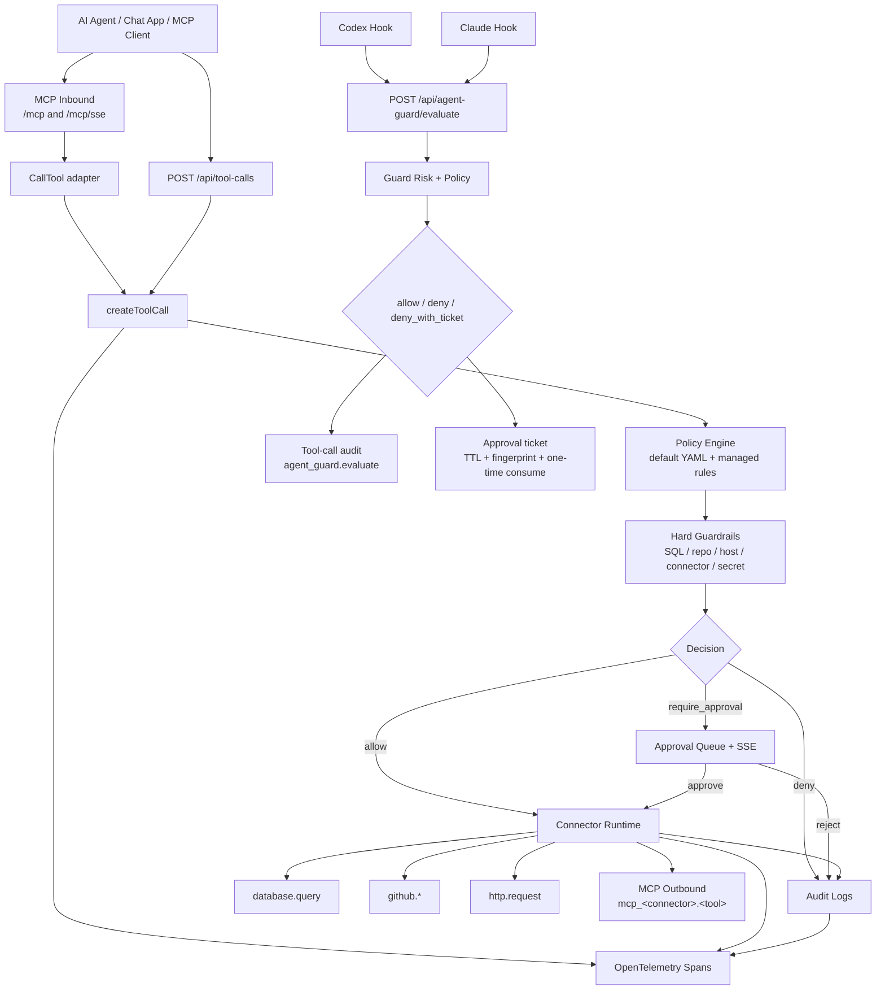

# AgentToolGate 架构说明

AgentToolGate 是本地 AI Agent 工具治理网关。它把 Agent 对数据库、GitHub、HTTP、MCP 和本地危险动作的调用收敛到一个可解释、可审批、可审计的治理层。

它不是 OS sandbox，也不是完整 enforcement boundary。它的职责是在工具调用落地前做确定性 guardrail：允许安全调用，拒绝明显危险调用，把需要人判断的调用送入 approval，并保留脱敏审计证据。

## 项目定位

ATG 解决的问题不是“模型永远不会被提示词注入”，而是：

- Agent 被提示词注入、上下文污染或误判影响后，真正危险通常发生在工具调用阶段。
- 数据库、GitHub、内部 HTTP 和外部 MCP 不应被 Agent 直接无治理调用。
- 本地写文件、执行脚本、改 hook、读 credential 路径也不应只依赖客户端自己的宽松权限提示。
- 安全评审需要看到 policy decision、approval status、trace id、risk explanation 和脱敏 input/output。

## 总体架构



## REST Tool Call 主链路

REST 工具调用入口是：

```text
POST /api/tool-calls
```

handler 解码 `{ "tool": "...", "arguments": {...} }` 后调用 `createToolCall`。

`createToolCall` 主链路包含：

- 创建 `agenttoolgate.request` 和 `agenttoolgate.auth` spans。
- 在当前 workspace 查找工具。
- 为公开审计生成脱敏 input。
- 检查 workspace rate limit。
- 执行默认 policy。
- 在审批或执行前做 adapter hard validation。
- 执行 workspace managed policy。
- 按结果进入三种分支：
  - `deny`：写 denied audit，不执行。
  - `require_approval`：创建 approval，内部保存冻结的 raw execution input，写 `approval_required` audit，推送 Approval SSE。
  - `allow`：执行 connector runtime，脱敏 output，写 success/failed audit。
- 将 OpenTelemetry trace id 持久化到 tool call。

审批通过时不会从 approve request body 重新读取参数，而是执行创建 approval 时冻结的内部 `input_execution_json`。approve/reject 完成后，该字段会清空为 `{}`。

## MCP Inbound 主链路

ATG 暴露两个 MCP inbound endpoint：

```text
Streamable HTTP: /mcp
SSE fallback:    /mcp/sse
```

两者都挂在同一 auth middleware 后面，支持同一组 JSON-RPC method：

- `initialize`
- `tools/list`
- `tools/call`

`tools/list` 只列出当前 workspace 启用的工具。`tools/call` 调用同一个应用层 `CallTool` adapter，再进入 `createToolCall`。因此 MCP inbound 不是绕过 policy、approval、audit、rate limit 或 connector runtime 的旁路。

如果工具需要审批，MCP response 返回 `approval_required` JSON-RPC error，并携带安全的 call id、approval id、reason 等 metadata。审批前不会触达上游 connector。

## MCP Outbound 主链路

外部 MCP Server 以 `type=mcp` Connector 接入。同步 connector 时会调用远端 `initialize` 和 `tools/list`，再把远端工具注册为本地 Tool Registry 条目：

```text
mcp_<connector>.<remote_tool>
```

治理 metadata 采用保守推断：

- `readOnlyHint=true` 或 `get/list/fetch/search*` 名称注册为 read/low，通常不需要审批。
- `destructiveHint=true` 注册为 delete/high，需要审批。
- `openWorldHint=true`、写类名称或未知名称都需要审批。

执行时，`mcp_*` 工具仍然是普通 tool call：按 workspace 查 connector，解析 env-backed `headerSecretRefs`，脱敏 payload，为写/未知风险工具创建 approval，写 audit explanation 和 OTel child span。

当前 MCP Outbound 只支持 HTTP + SSE transport，不应写成已支持 stdio、OAuth 或完整 Streamable HTTP outbound。

## Local Action Firewall 主链路

本地 hook adapter 会把 Claude / Codex PreToolUse payload 规范化后发送到：

```text
POST /api/agent-guard/evaluate
```

注意：Agent Guard 是独立入口，不是物理调用 `createToolCall`。它复用同一套治理思想和存储对象：policy、approval、audit、OTel 和 explanation，但内部编排是本地动作专用流程。

后端会分类：

- action type：read / write / exec / delete / patch / post
- target category：workspace / sensitive / self_tamper
- content signals：secret 关键词、私钥特征、base64、PowerShell hidden execution、encoded command
- canonical target 和可选 file identity

高风险或敏感动作返回 `deny_with_ticket` 并创建 approval。ticket 绑定 workspace、actor、adapter、tool、action type、canonical target、file identity / parent identity 和 content hash。高风险已批准 ticket 只能消费一次。低/中风险已批准 fingerprint 可以在 TTL 内 remembered allow；高风险不能变成长期静默放行。

## 核心模块职责

| 模块 | 职责 |
| --- | --- |
| Tool Registry | workspace-scoped 工具元数据、operation type、risk level、schema、enabled 状态 |
| Policy Engine | YAML 默认策略和 workspace 托管 policy rules |
| Approval | 人在回路队列、原子 approve/reject、自批保护 |
| Audit Logs | tool-call status、policy decision、approval status、risk explanation、脱敏 input/output |
| Secret Resolver | 运行时解析 env-backed `valueRef`；缺失、禁用或未配置时 fail closed |
| Connector Runtime | `database.query`、`github.*`、`http.request`、`mcp_*` 执行 |
| MCP Inbound | `/mcp` 和 `/mcp/sse` JSON-RPC 入口，进入 `createToolCall` |
| MCP Outbound | 外部 MCP sync/call，生成受治理的 `mcp_<connector>.<tool>` |
| Local Action Guard | 本地危险动作分类、解释和 `deny_with_ticket` |
| Telemetry | request、policy、approval、connector、audit spans |

## 数据流与信任边界

主要信任边界：

- Agent 或 MCP client 输入不可信。
- Tool arguments 在 adapter hard validation 之前不可信。
- 用户托管 policy 可以解释或收紧决策，但不能绕过 SQL guard、repo allowlist、HTTP allowlist、SSRF checks、MCP connector validation、secret resolution 或 rate limit。
- Secret 不是以明文 secret value 存储在 ATG。当前 Secret 只保存 metadata 和 env `valueRef`，后端只在运行时解析 env 值。
- Audit 是脱敏问责层，不是 raw payload 仓库。
- OpenTelemetry attribute 不能包含 raw SQL literal、headers、bodies、tokens、MCP session id 或 secret values。

## 可观测性

Tool call 会产生类似 spans：

```text
agenttoolgate.request
├── agenttoolgate.auth
├── agenttoolgate.policy.evaluate
├── agenttoolgate.approval.check
├── agenttoolgate.connector.execute
│   └── connector.database.query / connector.github.* / connector.http.request / connector.mcp.*
└── agenttoolgate.audit.write
```

`tool_calls.trace_id` 将 audit row 和 OpenTelemetry trace 关联起来。Audit 详情可展示 policy decision、approval status、redacted input/output、explanation fields 和 trace id。

## 非目标与边界

ATG 当前不提供：

- OS-level sandbox 或 kernel-level enforcement。
- 阻止提示词注入发生。
- KMS/Vault-backed secret storage。
- GitHub App installation-token 生产生命周期。
- 完整 HTTP SSRF 防护，尤其是 DNS rebinding 和 DNS 解析后私网 IP 变化。
- 完整生产 RBAC、backup、SLO、alerting、disaster recovery 或 policy rollout management。
- 完整 MCP OAuth、Dynamic Client Registration、resources、prompts、sampling 或大 payload governance。
- 完整 Codex interactive ask flow。Codex runtime 当前对需要确认的动作采用保守 deny/no-op 映射。
